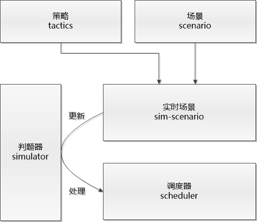

# Huawei 2019 CodeCraft
2019年华为软件精英挑战赛代码仓储

西北赛区队伍：我想喝手磨咖啡

初赛及复赛西北赛区第一，决赛32强，惨遭大佬们殴打，最美代码奖获得者（说真的内心有愧...

算法苦手，成绩不堪入目所以就把解题思路放在后面的位置，有兴趣的朋友可以一起讨论~

## Repo结构

这个repo实际上就是我们比赛一直在用的私有仓储，所以直接就是一个完整的VS工程加上一个备份目录backups，里面也包含cmake的内容，config的内容也在里面，所以下载的话会有11M左右，另外在公开的时候把可视化目录Visualization也加了进来，具体的可以看目录里面的介绍。

由于兼容原因，repo项目是VS2012构建的，更高版本VS需要修改项目设置中的平台工具集一类的的设置。

关于代码，实际上如果真的仔细看的话，也没有真正达到峰峰老师的要求，望各位海涵，也希望和大家多交流共同进步。

## 代码结构

基本抽象为5个部分：

- 底层基本代码(util)：如数据结构、基本功能、日志和中断等
- 赛题场景信息(scenario)：车辆、路口和道路等信息
- 仿真器(simulation)：判题器以及记录每个时间片状态的车辆和道路信息等
- 调度器(scheduler)：算法和策略
- 测试器(tester)：用于验证判题器和自制测试地图（实际并没有get到康康老师迷人的地图制作技巧，只是在瞎生成）

### 底层主要功能

|文件名|功能|
|----|----|
|log|运行日志|
|assert|断言宏|
|callback|回调封装|
|random|随机变量|
|timer|程序运行时间|

### 场景信息结构

这部分的信息是静态唯一的（从id的角度而言），在通过文件读入地图时进行加载和对象生成

|文件名|功能|
|----|----|
|car|车辆信息|
|cross|路口信息|
|road|道路信息|
|scenario|信息容器|

### 判题器结构

这部分属于动态信息，会与静态的场景信息相对应，比如car同一个id就只能有一个对象，但是sim-car就能有多个，目的是能够保存不同时间片下或是不同策略下的状态信息

|文件名|功能|
|----|----|
|sim-car|车辆运行信息，包含了所在道路信息，位置信息等|
|sim-road|道路信息，包含了在路上的所有车辆信息|
|sim-scenario|场景信息，上述信息的载体|
|tactics|需要输出答案的相关信息，包括路径信息和发车时间信息|
|simulator|判题器，以单时间片为单位对场景信息进行更新，完整运行时间约1.7s|

### 调度器结构

|文件名|功能|
|----|----|
|scheduler|调度器基类|
|dead-lock-solver|运行中通过回溯解除死锁|

由于我们的基本解题思路是基于运行中动态调整策略，所以调度器基类提供一下可重载虚函数接口：

|接口|功能|
|----|----|
|DoInitialize|初始化接口|
|DoUpdate|每个时间片更新前的接口|
|DoHandleBeforeGarageDispatch|每个时间片调度结束，发车之前的接口（便于在发车前再根据路况调整一次路径）|
|DoHandleGetoutGarage|每辆车在即将上路时调用的接口，用于最后决策一次是否能发车以及路径等|
|DoHandleBecomeFirstPriority|每辆车在成为第一优先级也就是能出路口时调用的接口，用于临时改路规避拥堵|
|DoHandleResult|每个时间片结束时调用的接口，如果发生死锁可以在此时进行解决|

特殊子类scheduler-answer仅仅在DoInitialize时读入答案，然后进行答案验证。

### 整体框架

总的来说，我们解题是基于判题器的，通过运行判题器发生事件，然后由调度器处理事件。当然如果仅仅把判题器当作纯粹的判题器来用也是没问题的。整体框架如下所示：

## 算法

我们算法没什么经验，所以做得也很粗糙，能走到这一步也算运气好了，借酸菜鱼dalao名言，就是又酸又菜又多余，看了咕咕咕dalao的代码之后（[友情链接](https://github.com/kongroo/Huawei-CodeCraft-2019)）,心服口服（抱紧大佬不放手

- 从始至终我们一直都用的flody动态改路的思想，路权使用的是当前时间片的路况信息和路长路宽，然后在发车的时候加了一些策略进去限制上路数量，比如在VIP车快结束的时候就不上普通车了，以免把VIP挡着，发车顺序为优先VIP车、速度小的以及路上消耗时间长的。总的来说都是一拍脑子加的一些玩意。

- 关于死锁解决，我们采用的是回溯的方法，在时间片更新完的时候检测到死锁的话，就找到死锁环上的第一优先级车，然后选一部分重新规划下一跳及其之后的路径，规划完之后，将时间片退回到改路的车成为第一优先级的时候（历史分歧点），然后重新开始跑，顺便还要记住这些路径以免发生循环死锁。

- 附加需求我们的处理方法是选择路上消耗时间长的预置VIP车来提高Tpri成绩，另外还留了一部分名额用于预置车死锁时解除死锁。

我们这个算法（scheduler-floyd）问题还是蛮大的，首先flody算路径的时候不能按每辆车来算，但是改成dijkstra的话因为每个时间片都会动态规划路径就会计算量爆炸，所以会出现车辆扎堆走的情况，其次是车辆上路和选路的判断依据为当前路况，不能保证路径现在空闲的路在车辆到达时仍然空闲，到时候就会因为拥塞而改路，也不能保证现在拥塞的路未来就不能往上走，道路利用率就很低。

然后我们就想用数学建模的方法预测未来路况(scheduler-time-weight)，在拿到一辆车的路径后，把车在路上走看成一个Markov过程（拥堵或顺利往前走），就能得到这辆车在每个时间片出现在每条路上的概率，然后就能估算未来某个时间片某条路的路况，根据路况就能用dijkstra更好的选路，也能更好的决定这车这时候能不能上路，预测的路况每时间片更新，已经在路上的车如果遇到拥堵或者和上路时预测路况差别很大的情况时再动态改路。不过我们又遇到一个问题，在一开始通过空间负载均衡规划好路径后，经过一段时间的发车，剩下的车经常负载不均衡，所以又得重新均衡重新分配路径，分配得越频繁，程序运行时间越长，毕竟6w辆车，跑6w次dijkstra（卒），反正到最后也没捣鼓出来好的解决方案，不过看着路况是非常舒服的，基本不会堵车，分布也很均衡的（然并卵）。

不知道有没有用类似方法的dalao交流一下更好的思路。
