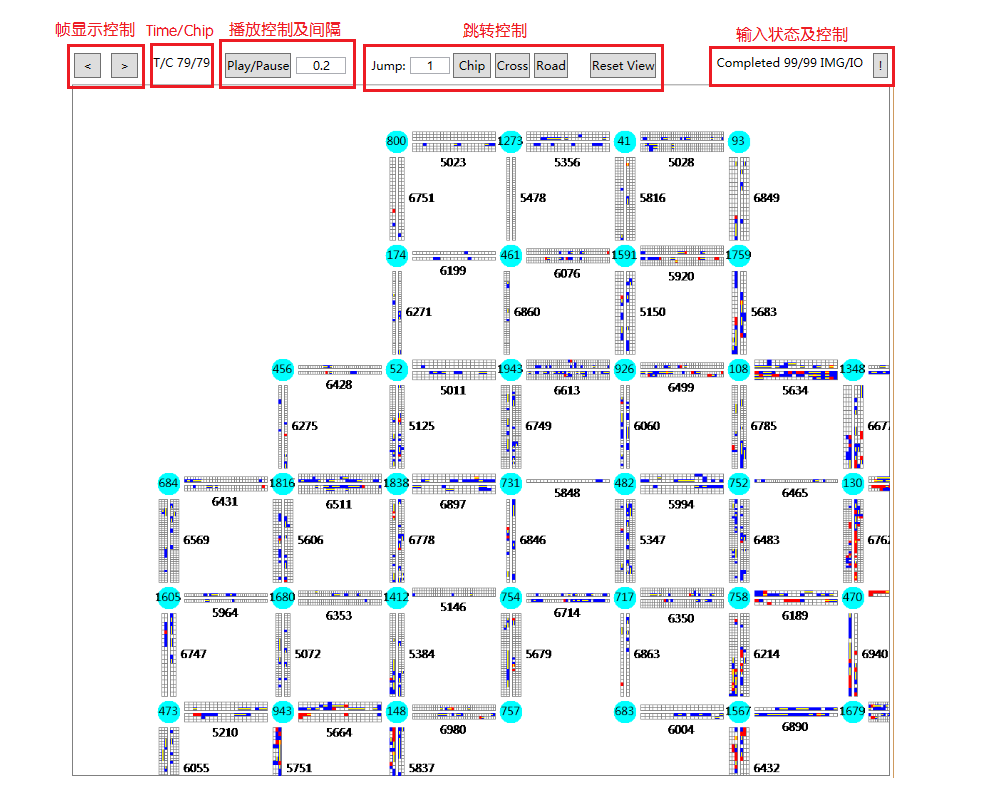

# 可视化

可视化思路来自于皮卡丘和电饭煲两队dalao，将路况信息主要以json的格式保存下来，然后进行显示。

bin/Realse目录下的可执行文件可以直接运行，并默认使用同目录下的config文件夹和log.tr文件作为输入，output文件夹作为输出，这些配置都可以在配置文件config.ini中更改

## 基本界面



## 基本功能和特性

- 支持time不连续（因为我们队伍自己的策略中就包含死锁掰路，就会发生回溯使time不连续），此时以绝对时间chip作为时间标识
- 支持快捷键操作（方向键左右控制帧浏览，空格控制播放暂停）
- 支持鼠标拖动和缩放显示
- 支持内容跳转，chip跳转到对应绝对时间，cross和road跳转到路口和道路并居中显示
- 支持停止输入（右上角感叹号按钮，在输入时点击则会停止输入，输入结束时点击则会重新输入）
- 三线程工作，UI线程、IO线程和渲染线程，一般IO线程会比渲染线程快很多，渲染进程决定UI能播放到哪个chip
- 支持log文件共享，即在比赛程序运行过程中，也能读取其中信息进行显示
- 支持错误提示，一般如果提示`关键字不在字典内`就是地图和log没对应上，log里出现的车辆id在地图里没找到

## 主要配置选项

配置在config.ini中更改，配置文件为JSON格式，没有配置文件则会在运行一次后自动生成

|项|内容|
|----|----|
|Path:ConfigDir|config目录|
|Path:LogFullPath|log路径|
|Path:OutputDir|图片保存路径|
|Size:CrossSize|路口图案半径|
|Size:CarWidth|车辆宽度|
|Size:RoadPadding|道路显示与路口中心的间距|
|Size:IntervalBetweenCross|路口间间距|
|Color:Backgroud|背景色|
|Color:Foregroud|前景色|
|Color:Font|字体|
|Color:Road|道路颜色|
|Color:Cross|路口颜色|
|Color:NormalCar|非预置车底色|
|Color:PresetCar|预置车底色|
|Color:VipMark|VIP车标记色|
|Parameter:SaveMemory|节省内存模式开关，会影响播放流畅度，但强烈建议开启|
|Parameter:SaveImage|保存图片开关，建议关闭，除非只为了画一张地图|

## Log文件

生成方法：

- 在比赛程序中，调用scheduler对象的EnableTrace函数并指定生成路径即可
- 如果已有answer.txt使用scheduler-answer对象跑一遍即可

文件格式：

```
time:N //N为表示当前时间片的整数
(RoadId,forward|backward,[[carId,carId,...],[...],...]) //车道按编号从小到大输出，车辆按上路闲后输出，空位输出-1
...
```
例：
```
time:1
(5001,forward,[[-1,-1],[102,103]])
(5001,backward,[[-1,-1],[-1,-1]])
```
这意味着5001的正向道路上，在2车道上102车在103车的前面。

具体可以参考bin/Realse/log.tr的内容
